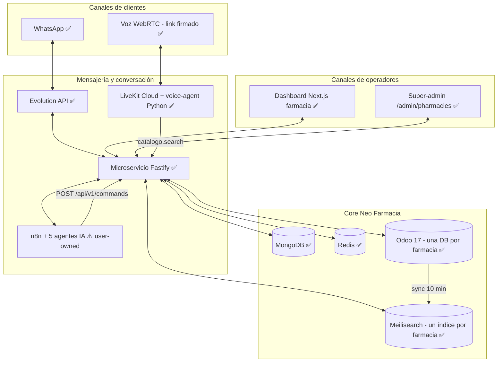
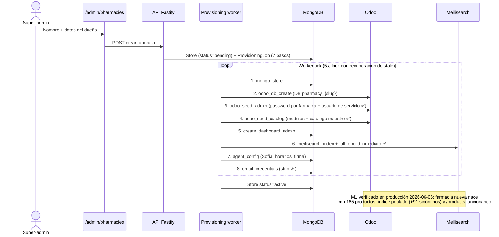
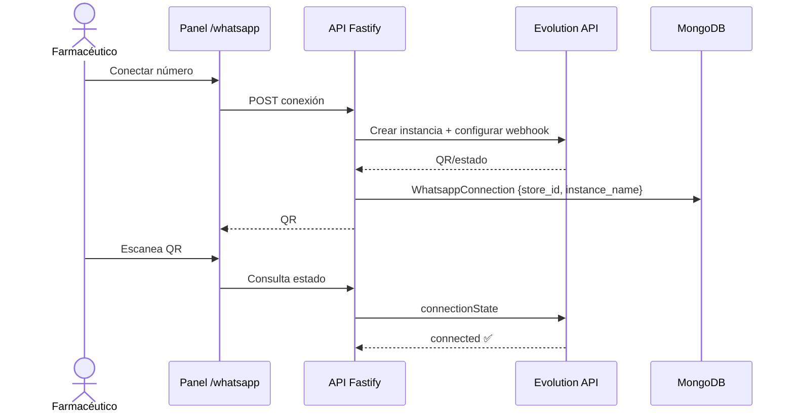
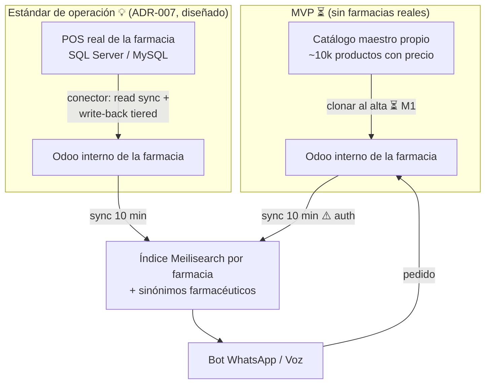
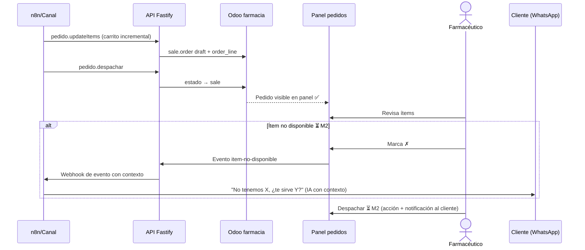
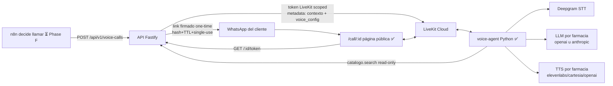

# Mapa Arquitectónico Integral de Neo Farmacia

**Corte de investigación:** 2026-06-06
**Alcance:** Neo Farmacia (monorepo `neo_farmacia`) y sus servicios relacionados
**Método:** inspección de código, configuraciones, documentación (`docs/`) y planes de MVP
**Documento hermano:** `neo_colmado/ARQUITECTURA_MODELO_NEGOCIO.md` (mismo modelo de negocio, lecciones heredadas)

**Leyenda de estado:**

| Indicador | Significado |
|---|---|
| ✅ | Operativo — construido y funcionando |
| ⚠️ | Parcial — construido con gap conocido |
| ⏳ | Pendiente — planificado dentro del MVP (M1–M4) |
| 💡 | Post-MVP — planificado, fuera del alcance del MVP |

## 1. Resumen ejecutivo

El modelo de negocio automatiza la venta conversacional y la operación diaria de
farmacias. El cliente compra hablando por WhatsApp o por llamada de voz IA. La IA
entiende la solicitud, consulta el catálogo de la farmacia, construye el pedido y
mantiene la conversación. El farmacéutico recibe el pedido en un panel web,
confirma disponibilidad, imprime y despacha.

A diferencia de NeoColmado —donde el inventario local **se aprende durante la
operación** (precio 0, confirmación del colmadero)— en farmacia el modelo es
**inverso: la farmacia ya tiene inventario confiable**. La estrategia de catálogo
es por etapas:

1. **MVP (sin farmacias reales):** catálogo maestro propio, clonado a cada
   farmacia nueva al provisionarla ✅ (M1, verificado en producción 2026-06-06)
   — *no es el estándar de operación*. Opcional M1.5 💡: stress test del
   pipeline con catálogo real de 17k (`pharmacy_inventory`).
2. **Estándar de operación:** el inventario de CADA farmacia entra por el
   **contrato de ingesta (ADR-008)**: Ingestion API pública y documentada;
   los conectores propios (ADR-007: SQL Server/MySQL, sync tiered) son
   clientes del mismo contrato 💡 — cambia *quién alimenta* el motor, no la
   arquitectura.

Lección heredada de colmado aplicada desde el día 1: **no hay bus implícito de
rutas** (el riesgo crítico #1 de NeoColmado con RTDB). Todos los contratos pasan
por la API Fastify; MongoDB guarda estado e historial, Redis coordina lo efímero,
Odoo es el motor transaccional interno por farmacia (la farmacia nunca lo ve) y
Meilisearch es el read-model de búsqueda del bot.

## 2. Mapa completo del ecosistema



No hay app Android: la operación de la farmacia es **web-only** por decisión
(ADR-006). No hay Firebase por decisión (ADR-003).

## 3. Capacidades del negocio

### 3.1 Adquisición y onboarding

1. Presentar el producto mediante landing page. 💡
2. Crear cuenta/farmacia desde el super-admin. ✅
3. Crear identidad, slug (`store_id`), DB Odoo, índice Meilisearch, admin del
   panel y configuración del agente — pipeline automático de 8 pasos. ✅
4. Sembrar el catálogo maestro en el Odoo de la farmacia nueva
   (paso `odoo_seed_catalog`: instala `sale_management`+`stock`+`product_expiry`
   y clona el catálogo). ✅ M1 verificado en producción 2026-06-06
5. Usuario de servicio interno por farmacia (catalog-sync, comandos y rutas
   del dashboard autentican con él). ✅ M1 — el bug era más amplio de lo
   documentado: no solo el sync, también pedidos y dashboard
6. Conectar uno o varios números de WhatsApp por QR. ✅
7. Entregar credenciales al dueño (paso `email_credentials`). ⚠️ stub — el
   super-admin las copia y entrega manualmente; email real pendiente
8. Conector de inventario real con el POS de la farmacia (ADR-007). 💡 post-MVP

### 3.2 Venta conversacional

1. Recibir mensaje de cliente. ✅
2. Identificar farmacia (instancia → `store_id`), cliente y conversación. ✅
3. Guardar historial en MongoDB antes de procesar. ✅
4. Determinar si responde IA u operador humano (handover ingress/egress). ✅
5. Detectar intención y productos (5 agentes n8n). ⚠️ user-owned, en adaptación
6. Consultar disponibilidad y precio (`catalogo.search` → Meilisearch). ⚠️
   `disponibleVentas` tiene `|| true` — el bot reporta todo como disponible;
   se resuelve con el patrón ✗ (M2) y de raíz con el conector (ADR-007)
7. Crear o actualizar carrito/pedido (`pedido.updateItems` → Odoo). ✅
8. Pedir datos faltantes del cliente (`usuario.ensure`). ✅
9. Confirmar pedido (`pedido.despachar`). ✅
10. Responder por el mismo canal (texto vía Evolution). ✅ — pasada e2e final
    del loop completo pendiente post-fix del silent-drop ⏳ **M4**
11. Escalar a llamada de voz cuando la conversación lo amerite. ⏳ **M3** (Phase F)

### 3.3 Operación de la farmacia

1. Ver pedidos nuevos y pendientes en el panel. ✅
2. Confirmar/rechazar ítems al despachar — **patrón ✗ heredado de colmado**:
   ítem no disponible → evento → la IA avisa al cliente con contexto y sugiere
   sustituto. ⏳ **M2**
3. Marcar pedido despachado + notificación al cliente. ⏳ **M2**
4. Conversar manualmente con el cliente (handover, vista de chats). ✅
5. Consultar historial, clientes, productos y reportes. ✅
6. Configurar su agente ("Mi Agente": nombre, saludo, horario, delivery). ✅
7. Imprimir el pedido. ⏳ — sin flujo dedicado aún (impresión de navegador)

### 3.4 Administración SaaS

1. Gestionar farmacias: crear, ver pipeline de provisioning, reintentar pasos,
   eliminar (drop completo de DB + índice). ✅
2. Gestionar `voice_config` por farmacia (proveedores STT/LLM/TTS, voz,
   expresividad, prompt template) con "aplicar a todas". ✅
3. Gestionar conexiones WhatsApp por farmacia. ✅
4. Observar salud de la flota (conexión viva, último sync, mensajes fluyendo,
   errores recientes) sin revisar farmacia por farmacia. ⏳ **M4**
5. Facturación/cobro a farmacias. 💡

## 4. Arquitectura Neo Farmacia

### 4.1 Principio rector

Cada responsabilidad tiene un dueño explícito — la corrección directa al
riesgo crítico #1 de NeoColmado (contratos implícitos en rutas RTDB):

- **API Fastify** — único punto de contratos: webhook de WhatsApp, comandos de
  n8n, REST del panel, llamadas de voz. Todo carga `store_id`.
- **MongoDB** — historial conversacional, usuarios, stores, conexiones,
  sesiones de voz, jobs de provisioning, idempotencia de comandos.
- **Redis** — coordinación efímera: debounce, mutex por conversación (SETNX),
  estado de handover, lock una-llamada-activa-por-chat, rate limit, cache.
- **Odoo (una DB por farmacia)** — motor transaccional interno: productos,
  partners, `sale.order`. **La farmacia nunca lo ve ni lo toca.** Es el SSoT
  del canal WhatsApp (ADR-004), alimentado hoy por el catálogo maestro ⏳ y
  mañana por el conector POS 💡.
- **Meilisearch (un índice por farmacia)** — read-model de búsqueda fuzzy del
  bot, sincronizado desde el Odoo de cada farmacia cada 10 minutos.
- **n8n** — razonamiento IA. No es fuente de verdad: sus decisiones se
  materializan vía `POST /api/v1/commands` (idempotente).

### 4.2 Flujo de alta de una farmacia



Pasos fallidos se reintentan desde el super-admin (`retryJob`). La eliminación
hace drop completo en orden inverso (Meili → Odoo → Mongo) y se niega a borrar
la farmacia default (`store_leo`, que adoptó la DB Odoo original).

### 4.3 Conexión de WhatsApp



Multi-conexión por farmacia soportada. El `store-resolver` resuelve
`instance_name → {store, connection}` con cache in-process de 60s e
invalidación al crear/borrar conexiones. Instancias huérfanas en Evolution se
limpian con un click desde el panel. ✅

### 4.4 Flujo WhatsApp entrante y respuesta IA

```mermaid
sequenceDiagram
  actor C as Cliente
  participant E as Evolution API
  participant API as API Fastify (webhook)
  participant R as Redis
  participant M as MongoDB
  participant N as n8n IA
  participant S as Meilisearch
  participant O as Odoo farmacia

  C->>E: Mensaje WhatsApp
  E->>API: POST /webhook (raw event)
  API->>API: resolveStoreByInstance + extractText (envelopes, captions, botones)
  API->>R: Idempotencia por message ID
  API->>M: Persistir mensaje ANTES de procesar
  API->>R: Handover check (¿modo humano? → no IA)
  API->>R: Debounce (acumula ráfagas; TTL > ventana — fix 72ee0f6)
  API->>R: Mutex por conversación (SETNX)
  API->>N: Payload {text, storeId, chatId, store_config{agente, horario, firma...}}
  N->>API: POST /api/v1/commands (bearer + commandId idempotente)
  API->>S: catalogo.search (índice de ESA farmacia)
  API->>O: pedido.updateItems / despachar (Odoo de ESA farmacia)
  N-->>API: Texto de respuesta (campo output/reply)
  API->>E: sendText
  API->>M: Persistir respuesta (egress + handover check)
  E-->>C: Respuesta WhatsApp ✅
```

Propiedades importantes:

- El mensaje se persiste antes de entrar a IA (regla heredada de colmado). ✅
- **Un solo workflow n8n compartido sirve a N farmacias** — el payload lleva
  `storeId` + `store_config`; no se clona nada por tenant (misma lección que el
  `colmado-router-app`). ✅
- Idempotencia en ambas direcciones: message ID en ingreso, `commandId` con
  colección `processed_commands` en comandos. ✅
- El bug del silent-drop (TTL del debounce expiraba antes de su propio check)
  fue root-causado y corregido (`72ee0f6`); falta la pasada e2e final. ⏳ **M4**
- Los 5 agentes n8n (intención, diálogo, carrito, registro, fallback) están en
  adaptación de colmado → farmacia (user-owned). ⚠️

### 4.5 Inventario — modelo inverso al colmado



- En colmado el conocimiento local se construye pregunta a pregunta (precio 0 →
  colmadero confirma). En farmacia **el catálogo llega completo** y la farmacia
  solo ajusta precios. El equivalente farmacéutico del aprendizaje es el
  **patrón ✗ al despachar** (4.6) mientras no haya stock real conectado.
- El conector (ADR-007) define ingesta tiered de vuelta al POS: stock < 5 →
  hold con confirmación humana; 5–10 → push inmediato; > 10 → batch nocturno
  con reconciliación. 💡
- Sinónimos farmacéuticos sembrados en cada índice (genérico ↔ marca). ✅
- Gap activo: `disponibleVentas || true` — el bot no valida stock real. ⚠️

### 4.6 Pedido y despacho



El ciclo n8n → Odoo → panel existe ✅; las **acciones del farmacéutico sobre el
pedido** (✗ por ítem, despachar con aviso) son el corazón de M2. ⏳

### 4.7 Voz Neo Farmacia (Stage 9, v3)



Estado por componente:

| Componente | Estado |
|---|---|
| `voice_call_sessions` — máquina de estados atómica, idempotencia compuesta `{store_id, idempotency_key}`, lock una-activa-por-chat, sweep de timbres perdidos | ✅ |
| Link firmado one-time + página pública `/call/:id` (ring/answer/reject) | ✅ |
| `POST /api/v1/voice-calls` para n8n (bearer constant-time, validación chat∈store) | ✅ |
| `voice_config` por farmacia en super-admin + "aplicar a todas" + dropdowns de disponibilidad por proveedor | ✅ |
| Token LiveKit scoped con contexto + config en metadata | ✅ |
| Worker Python (`packages/voice-agent/`) — STT/LLM/TTS construidos por llamada según `voice_config`, prosodia ElevenLabs estabilizada, knobs `tts_stability`/`tts_style` | ✅ |
| Prompt template propiedad del admin + contexto real por llamada (mensajes Mongo + pedido + cliente) — Phase E | ✅ |
| Política v1: read-only, solo `catalogo.search`, sin mutar pedidos, **rechaza consejo clínico** | ✅ |
| Phase F — n8n decide, crea la llamada y manda el link | ⏳ **M3** |
| Phase G — hardening: transcripts a Mongo, watchdog, llamada perdida → seguimiento por WhatsApp, takeover humano | ⏳ **M3** |
| Herramientas de carrito por voz (agregar/quitar/someter como en colmado) | 💡 tras validar v1 read-only |

### 4.8 Dashboard del farmacéutico (web-only, ADR-006)

| Página | Función | Estado |
|---|---|---|
| Home / stats | KPIs del día por farmacia | ✅ |
| `/orders` | Pedidos entrantes | ✅ lista — acciones ✗/despachar ⏳ M2 |
| `/products` | Catálogo de la farmacia | ✅ |
| `/chats` | Historial + conversación manual (handover) | ✅ |
| `/customers` | Clientes | ✅ |
| `/reports` | Reportes | ✅ |
| `/whatsapp` | Conexión multi-número por QR | ✅ |
| `/agent` | "Mi Agente": persona, saludo, horarios, delivery | ✅ |
| `/settings` | Configuración | ✅ |
| `/admin/pharmacies` | Super-admin: provisioning + voice_config | ✅ |
| `/call/[id]` | Página pública de llamada (cliente, link firmado) | ✅ |
| `/login` | Autenticación JWT | ✅ |

### 4.9 Cerebro n8n

Mismo modelo que el `Version con inventario` de colmado, adaptándose a farmacia
(user-owned ⚠️):

| Función n8n | Responsabilidad | Estado |
|---|---|---|
| Webhook/router | Recibir payload normalizado del microservicio | ✅ |
| Detección de intención | Clasificar la solicitud | ⚠️ adaptación |
| Dialogue Agent | Conversación y siguiente acción | ⚠️ adaptación |
| Agente carrito | `pedido.updateItems` / `despachar` / `cancel` | ⚠️ adaptación |
| Registration agent | `usuario.ensure` con datos faltantes | ⚠️ adaptación |
| Fallback agent | Fuera de flujo / ambiguo | ⚠️ adaptación |
| Tool de búsqueda | `catalogo.search` (Meilisearch de la farmacia) | ✅ |
| Personalización | Lee `store_config` del payload (no prompts por tenant) | ✅ |
| Nodo de decisión de llamada | `POST /api/v1/voice-calls` + link por WhatsApp | ⏳ M3 |
| Evento ✗ → aviso al cliente | Webhook de evento con contexto del pedido | ⏳ M2 |

n8n no es fuente de verdad: todo se materializa vía comandos idempotentes.

## 5. Catálogo de comandos y API

### 5.1 Comandos n8n (`POST /api/v1/commands`, bearer + idempotencia)

| Comando | Responsabilidad | Estado |
|---|---|---|
| `usuario.lookupCombined` | Identificar cliente por teléfono/chat | ✅ |
| `usuario.ensure` | Crear/actualizar cliente | ✅ |
| `catalogo.search` | Búsqueda fuzzy en el índice de la farmacia | ✅ ⚠️ `disponibleVentas` |
| `pedido.updateItems` | Carrito incremental (add/update/remove) en Odoo | ✅ |
| `pedido.consultarPrecio` | Precio/stock sin tocar carrito | ✅ |
| `pedido.despachar` | Confirmar draft → sale | ✅ |
| `pedido.cancel` | Cancelar pedido | ✅ |
| `pedido.itemNoDisponible` (o equivalente del patrón ✗) | Rechazo por ítem + evento a n8n | ⏳ M2 |

### 5.2 Superficie REST (panel + voz)

| Módulo | Rutas | Estado |
|---|---|---|
| `auth` | Login JWT, modelo Admin | ✅ |
| `stores` | CRUD + `agent_config` + `voice_config` (PATCH role=admin) | ✅ |
| `provisioning` | Alta/retry/delete de farmacias (super-admin) | ✅ |
| `whatsapp` | Conexiones multi-número, QR, estado, limpieza de huérfanas | ✅ |
| `webhook` | Ingreso de Evolution + store-resolver | ✅ |
| `chats` / `customers` / `orders` / `products` / `stats` | Lectura scoped (guard `resolveStore` — leak cross-tenant cerrado `ab0c5c0`) | ✅ |
| `handover` | Bot ↔ humano | ✅ |
| `voice-calls` | Create (n8n), señal pública, token LiveKit, disponibilidad de proveedores | ✅ |
| `catalog-sync` | Rebuild/sync por farmacia | ✅ (auth M1 resuelto) |
| `odoo` (passthrough legacy) | — | ⚠️ muerto (~280 LOC), borrado pendiente de confirmación con n8n vivo |

## 6. Modelo de datos

| Almacén | Entidad | Propiedad de negocio |
|---|---|---|
| MongoDB | `stores` | Identidad del tenant: `store_id`, `odoo_db`, `meilisearch_index`, `agent_config`, `voice_config`, status |
| MongoDB | `provisioning_jobs` | Pipeline de alta con estado por paso, lock y retry |
| MongoDB | `admins` | Usuarios del panel (super-admin y por farmacia) |
| MongoDB | `users` | Clientes finales por `{store_id, chat_id}` |
| MongoDB | `messages` | Historial conversacional (ingress y egress) |
| MongoDB | `whatsapp_connections` | `instance_name → store_id` (multi-número) |
| MongoDB | `voice_call_sessions` | Máquina de estados de llamada, hash del link, idempotencia |
| MongoDB | `processed_commands` | Idempotencia de comandos n8n |
| Redis | claves efímeras | Debounce, mutex por conversación, handover, lock de llamada activa, cache |
| Odoo (por farmacia) | `product.product`, `res.partner`, `sale.order` | Catálogo, clientes Odoo y pedidos del canal WhatsApp |
| Meilisearch | `store_{id}_products` | Read-model de búsqueda + sinónimos farmacéuticos |

Regla transversal: **todo carga `store_id`**; cero fuga cross-tenant (auditado y
corregido 2026-06-03).

## 7. Despliegue y flujo de cambios


| Componente | Ubicación | Despliegue | Dominio |
|---|---|---|---|
| API Fastify | `packages/api` | Dokploy | `api.leofarmacia.com` ✅ |
| Dashboard Next.js | `packages/dashboard` | Dokploy | `panel.leofarmacia.com` ✅ |
| voice-agent Python | `packages/voice-agent` | Dokploy (servicio dedicado) + LiveKit Cloud | — ✅ |
| Odoo 17 + Postgres | `docker-compose.yml` (repo) | Dokploy | `pos.leofarmacia.com` ✅ |
| MongoDB / Redis | servicios de infra Dokploy | Dokploy | interno ✅ |
| Meilisearch / Evolution / n8n | servicios Dokploy | Dokploy | interno ✅ |

Reglas de despliegue: el repo es la fuente de verdad de infra/compose; los
secrets viven en el entorno de Dokploy, nunca hardcodeados. ⚠️ Pendiente:
`docker-compose.dokploy.yml` está sin commitear y contiene un `JWT_SECRET` de
placeholder — regularizar o descartar.

## 8. Reglas de negocio transversales

1. Todo mensaje queda registrado antes de su procesamiento. ✅
2. Toda acción está aislada por `store_id`; cero cruce entre farmacias. ✅
3. Los eventos externos son al-menos-una-vez; idempotencia en webhook (message
   ID) y comandos (`commandId`). ✅
4. Un operador humano puede tomar control de una conversación; la IA no
   responde después del handover. ✅
5. El pedido conserva correlación con la conversación. ✅
6. **En farmacia, la disponibilidad la confirma el humano al despachar
   (patrón ✗) mientras no exista conector de stock real.** ⏳ M2 → 💡 ADR-007
7. Un ✗ siempre produce corrección del pedido y aviso al cliente vía IA con
   contexto. ⏳ M2
8. La IA de voz es read-only y **nunca da consejo clínico**. ✅
9. Un fallo de IA no impide que el farmacéutico vea o gestione el pedido. ✅
10. Los secretos pertenecen al entorno (Dokploy env), nunca al cliente ni al
    repo. ✅
11. n8n no es fuente de verdad; Odoo es SSoT del canal WhatsApp (ADR-004);
    Meilisearch nunca es fuente contable. ✅

## 9. Puntos de riesgo y deuda arquitectónica

### Críticos (bloquean escalar)

- ~~**Catalog-sync auth**~~ ✅ RESUELTO (M1, `e935216`): usuario de servicio
  interno sembrado por el provisioning en cada DB tenant. El alcance real era
  mayor: también comandos (pedidos) y rutas del dashboard. `farmacia_geremy`
  (rota pre-fix) eliminada.
- ~~**Catálogo inicial**~~ ✅ RESUELTO (M1, `757bdbc`+`8897aad`+`92dffa9`):
  paso `odoo_seed_catalog` (módulos + clonado) + rebuild Meili inmediato.
  Verificado en producción. El inventario real por farmacia llega vía el
  contrato de ingesta (ADR-008) cuando haya cliente; M1.5 💡 queda como
  stress test opcional con `pharmacy_inventory` (17,456).
- **Pasada e2e del loop completo** ⏳ M4: el silent-drop está corregido pero el
  ciclo WhatsApp → n8n → respuesta no tiene verificación end-to-end formal
  post-fix.

### Altos

- `disponibleVentas || true` ⚠️: el bot promete disponibilidad que no valida.
  Mitigado por patrón ✗ (M2); resuelto de raíz por ADR-007 💡.
- Voz sin Phase F/G ⏳ M3: la llamada funciona pero nada la dispara en
  producción y no hay transcripts/watchdog — es demo, no producto.
- Todos los servicios dependen de un solo VPS/Dokploy: punto único de fallo
  (igual que colmado). Stage 8 (Production: backups, monitoreo, alertas)
  sigue `pending`. 💡
- El password admin por farmacia vive en texto plano dentro del job de
  provisioning hasta que el super-admin marca "entregado" — aceptable como
  stub, endurecer con email real. ⚠️

### Operativos

- Health board de flota ⏳ M4 — sin él, operar 10+ farmacias exige revisión
  manual por farmacia.
- Módulo legacy `odoo.ts` + `modules/odoo` muerto (~280 LOC) — borrar tras
  confirmar con n8n vivo. Gráficas duplicadas home/reports (~200 LOC).
- `cache lastSyncByStore` del catalog-sync es in-process: un redeploy fuerza
  full rebuild por farmacia (aceptable a baja escala).
- Separar formalmente `producción`, `en prueba`, `planeado` en docs — este
  documento usa los indicadores ✅/⚠️/⏳/💡 con ese fin.

## 10. Fronteras recomendadas de responsabilidad

| Componente | Debe ser responsable de | No debe ser responsable de |
|---|---|---|
| Evolution | transportar WhatsApp | reglas de negocio |
| API Fastify | contratos, invariantes, idempotencia, aislamiento por tenant | razonamiento IA |
| n8n | razonamiento y orquestación IA | ser fuente de verdad |
| MongoDB | estado operativo e historial | lógica compleja no versionada |
| Redis | coordinación efímera | persistencia de negocio |
| Odoo | motor transaccional interno por farmacia (SSoT canal WhatsApp) | ser visible para la farmacia |
| Meilisearch | búsqueda fuzzy | fuente contable de inventario |
| voice-agent | conversación de voz read-only | mutar pedidos o dar consejo clínico |
| Dashboard | operación de la farmacia y administración SaaS | transporte WhatsApp |
| Conector POS 💡 | ingesta de inventario real y write-back tiered | sustituir a Odoo como motor |

## 11. Definición compacta del modelo de negocio

Neo Farmacia convierte conversaciones en operaciones comerciales trazables.

- **Entrada:** intención expresada por WhatsApp o voz.
- **Inteligencia:** n8n y agentes interpretan, consultan y coordinan.
- **Memoria:** MongoDB para estado, conversaciones y sesiones; Redis para
  coordinación; Odoo para la transacción.
- **Ejecución:** panel web del farmacéutico (pedido → ✗/✓ → despacho).
- **Conocimiento:** catálogo completo desde el día 1 (maestro ⏳ → conector
  real 💡), no aprendido pregunta a pregunta como en colmado.
- **Cierre:** pedido confirmado, despachado, cliente informado, evento
  registrado.
- **Escala SaaS:** cada farmacia obtiene identidad, DB Odoo, índice de
  búsqueda, canal WhatsApp, agente contextualizado y configuración de voz —
  provisionados por pipeline automático en minutos.

## 12. Estado del MVP escalable (resumen ejecutable)

| Milestone | Entregable | Piezas | Estado |
|---|---|---|---|
| **M1 — Alta sistemática** | Farmacia nueva vendiendo en minutos | Paso `odoo_seed_catalog` (módulos + clonado JSON-RPC) + usuario de servicio por farmacia | ✅ 2026-06-06 |
| **M1.5 — Stress test catálogo real** | Validar pipeline a escala 17k productos (opcional, despriorizada) | Importador `pharmacy_inventory` → DB `pharmacy_master_catalog` + `MASTER_CATALOG_DB` | 💡 |
| **M2 — Ciclo cerrado** | Pedido → despacho → cliente informado | Acciones ✗/✓ por ítem en `/orders` + evento ✗ → n8n → aviso IA + despacho con notificación | ⏳ |
| **M3 — Voz en el ciclo** | Llamada como parte del flujo | Phase F (n8n dispara + link) + Phase G mínimo (transcripts, llamada perdida) | ⏳ |
| **M4 — Operar la flota** | Escalar sin revisión manual | Health board admin + pasada e2e formal del ciclo con farmacia recién provisionada | ⏳ |
| Post-MVP | Estándar de operación | Conector POS real (ADR-007), email de credenciales, landing, recordatorios de refill a crónicos, facturación SaaS | 💡 |

## 13. Evidencia principal inspeccionada

- `packages/api/src/modules/provisioning/` (pipeline 7 pasos, worker, modelos)
- `packages/api/src/modules/catalog-sync/catalog-sync.service.ts` (sync + bug auth)
- `packages/api/src/modules/webhook/webhook.handler.ts` + `store-resolver.ts`
- `packages/api/src/modules/commands/` (router idempotente + handlers)
- `packages/api/src/modules/commands/handlers/pedido.handler.ts` (ciclo Odoo)
- `packages/api/src/modules/voice-calls/` + `packages/voice-agent/`
- `packages/api/src/shared/odoo-scoped-cache.ts`
- `docker-compose.yml`, `docker-compose.dokploy.yml` (sin commitear)
- `docs/ROADMAP.md` (snapshot 2026-06-03), `docs/stages/06-pos-sync.md`,
  `docs/stages/09-voice-calls.md`, `docs/decisions/001–007`
- `docs/sessions/2026-06-03-01.md` + commits `c01c2c5…d5469fa`
- `neo_colmado/ARQUITECTURA_MODELO_NEGOCIO.md` (plantilla y lecciones)
