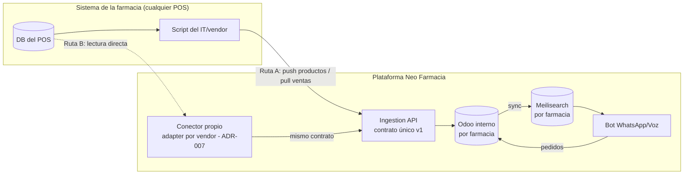
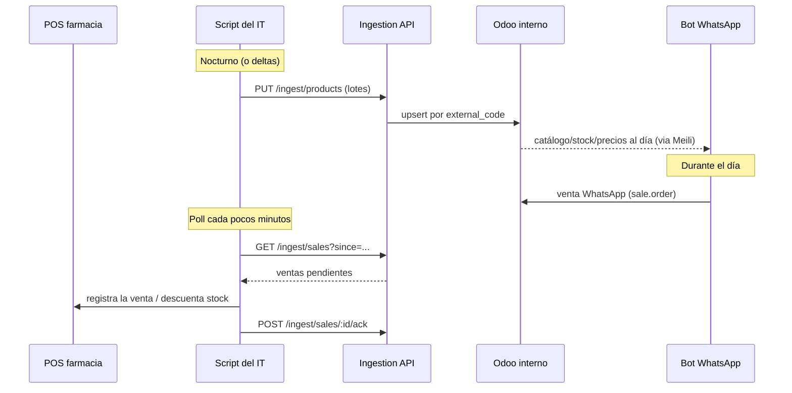

# Integración de inventario: cómo una farmacia conecta su sistema

**Estado**: diseño aprobado (ADR-008, 2026-06-06) — se implementa cuando llegue
el primer cliente real.
**Audiencia**: este documento tiene dos partes — una explicación simple (para
entender el modelo y para la conversación comercial) y la especificación
técnica (para el equipo y para el IT de la farmacia).

---

## Parte 1 — La explicación simple

### El problema

Cada farmacia ya tiene un sistema donde vive su inventario (su POS). No hay dos
iguales: distintos fabricantes, distintas bases de datos, distintos formatos.
Un "conector universal" que funcione con todos automáticamente **no existe** —
ni para nosotros ni para nadie en la industria.

### La solución: nosotros ponemos el enchufe, no el cable

En vez de intentar adaptarnos a cada sistema (imposible de escalar), definimos
**una sola puerta de entrada, simple y bien documentada** — como un enchufe de
pared estándar. Quien quiera conectarse, conecta su cable a NUESTRO enchufe.

Esto les pasa la pelota de forma elegante: cuando el dueño compra, le dice a su
departamento de IT o al proveedor de su sistema *"trabajen con ellos"* — y lo
que su IT recibe de nosotros es una guía de **una página con 2 operaciones**.
Nada de reuniones interminables ni accesos raros a sus servidores.

### Las dos rutas para conectarse

| Ruta | Para quién | Cómo funciona |
|---|---|---|
| **A. Su IT se conecta** | Farmacias con departamento de IT o proveedor de software activo | Su sistema nos envía el catálogo (productos, precios, stock) y consulta las ventas de WhatsApp para registrarlas en su POS. Dos operaciones, una API key, listo. |
| **B. Nosotros nos conectamos** | Farmacias sin IT | Instalamos un conector nuestro que lee su base de datos y usa exactamente la misma puerta de entrada. La farmacia no hace nada. |

### Qué cambia para la farmacia en el día a día

1. Su inventario aparece en el bot de WhatsApp **con sus precios y su stock
   real** — el bot deja de depender de confirmación manual de disponibilidad.
2. Cuando el bot vende algo, esa venta **se refleja en su POS** — el inventario
   físico y el digital nunca se desincronizan.
3. Si cambian un precio en su sistema, el bot lo sabe en minutos.

### La frase para la venta

> "No necesito acceso a tu sistema. Tu técnico entra a nuestra guía de
> integración, son 2 operaciones con ejemplos copy-paste, y tu farmacia queda
> conectada. Y si no tienes técnico, lo conectamos nosotros."

---

## Parte 2 — Especificación técnica

### Arquitectura



**Invariante**: una sola puerta de ingesta. Los conectores propios (Ruta B) son
clientes del mismo contrato que el IT externo (Ruta A). Nunca dos caminos de
ingesta que mantener.

### Autenticación

- **API key por farmacia**, emitida desde el super-admin, revocable, con scope
  al `store_id`. Header: `Authorization: Bearer <key>`.
- Rate limit por key. Toda petición queda logueada (auditoría por tenant).

### Operación 1 — Catálogo y stock (farmacia → plataforma)

```
PUT /api/v1/ingest/products
Content-Type: application/json
Authorization: Bearer <api-key-de-la-farmacia>
```

```json
{
  "products": [
    {
      "external_code": "11422",
      "name": "ADVIL X 12 TAB",
      "price": 11.12,
      "stock": 34,
      "barcode": "7460123456789",
      "category": "Analgésicos",
      "unit": "UNIDAD",
      "expiry_tracking": true,
      "active": true
    }
  ]
}
```

| Campo | Req | Notas |
|---|---|---|
| `external_code` | ✔ | El SKU del sistema de la farmacia. **Llave de idempotencia** → `default_code` en su Odoo |
| `name` | ✔ | Descripción del producto |
| `price` | ✔ | Precio de venta (moneda del store) |
| `stock` | — | Si se omite, no se toca el stock existente |
| `barcode` | — | Duplicados se ignoran con warning, nunca rompen el lote |
| `category` | — | Se crea si no existe (plana) |
| `unit` | — | Mapeo best-effort a `uom`; default UNIDAD |
| `expiry_tracking` | — | Activa lotes/vencimiento (`product_expiry`) |
| `active` | — | `false` = retirar del catálogo del bot (archiva en Odoo) |

Semántica:

- **Upsert idempotente** por `external_code`: reenviar el mismo payload es
  seguro. Lotes de **≤1000 productos**; respuesta por lote con conteos
  `{created, updated, skipped, errors[]}` y detalle por registro fallido.
- La no-estandarización de la industria **se absorbe aquí**: solo 3 campos
  obligatorios; todo lo demás es opcional y tolerante.
- Full-sync periódico (p. ej. nocturno) es válido y suficiente al inicio;
  deltas cuando el vendor pueda.
- Tras la ingesta, el pipeline existente hace el resto: Odoo (SSoT del canal)
  → sync → Meilisearch → bot. Con stock real fluyendo, se apaga el
  `disponibleVentas: || true`.

### Operación 2 — Ventas WhatsApp (plataforma → farmacia), invertida a pull

El riesgo más alto del diseño original (ADR-007) era escribir nosotros en la DB
del POS ajeno. **Se invierte la dirección**: el sistema de la farmacia consulta
y confirma.

```
GET /api/v1/ingest/sales?since=2026-06-06T00:00:00Z&status=pending
```

```json
{
  "sales": [
    {
      "sale_id": "S00042",
      "created_at": "2026-06-06T14:22:10Z",
      "items": [
        { "external_code": "11422", "qty": 2, "unit_price": 11.12 }
      ],
      "total": 22.24,
      "channel": "whatsapp"
    }
  ]
}
```

```
POST /api/v1/ingest/sales/S00042/ack     → marca la venta como reflejada en el POS
```

Semántica:

- `GET` es paginado y repetible; una venta sale de `pending` solo con su `ack`
  (idempotente — re-ack no falla).
- El IT decide la frecuencia del poll (cada 1-5 min es típico).
- La **semántica tiered de ADR-007 se conserva** donde aplica: ventas con stock
  crítico (<5) entran como `pending_confirmation` y el farmacéutico confirma
  desde el panel antes de exponerse al pull; reconciliación nocturna detecta
  ventas sin ack.
- Cuando el conector lo operamos nosotros (Ruta B), el mismo flujo corre con el
  adapter haciendo el poll + escritura al POS según ADR-007.

### Flujo completo (Ruta A)



### Qué NO es este contrato

- No es acceso a nuestro Odoo ni al de la farmacia — ninguna de las dos partes
  toca la DB de la otra.
- No reemplaza el comando `catalogo.search` de n8n (eso es consumo interno del
  bot); esto es exclusivamente la frontera con sistemas externos.
- No exige tiempo real: el MVP del contrato funciona con full-sync nocturno +
  poll de ventas.

### Plan de implementación (cuando llegue el primer cliente)

1. Módulo `ingest` en el API: API keys por store (modelo + emisión en
   super-admin), validación de lotes, upsert a Odoo scoped, endpoints de sales
   + ack, rate limit.
2. Guía pública de integración (1 página) con ejemplos copy-paste y sandbox
   (farmacia de prueba con API key de prueba).
3. Primer adapter (según el POS del primer cliente) construido como cliente
   interno del contrato — valida que la Ruta B y la Ruta A son la misma puerta.

### Referencias

- **ADR-008** — decisión y racional: `docs/decisions/008-ingestion-api-contract.md`
- **ADR-007** — semántica tiered del write-back: `docs/decisions/007-tiered-pos-sync.md`
- **Stage 6 (POS Sync)** — adapters por vendor: `docs/stages/06-pos-sync.md`
- **Mapa de negocio** — contexto completo: `ARQUITECTURA_MODELO_NEGOCIO.md` §4.5
